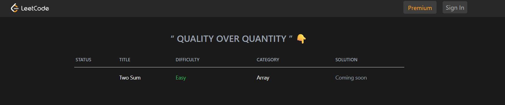
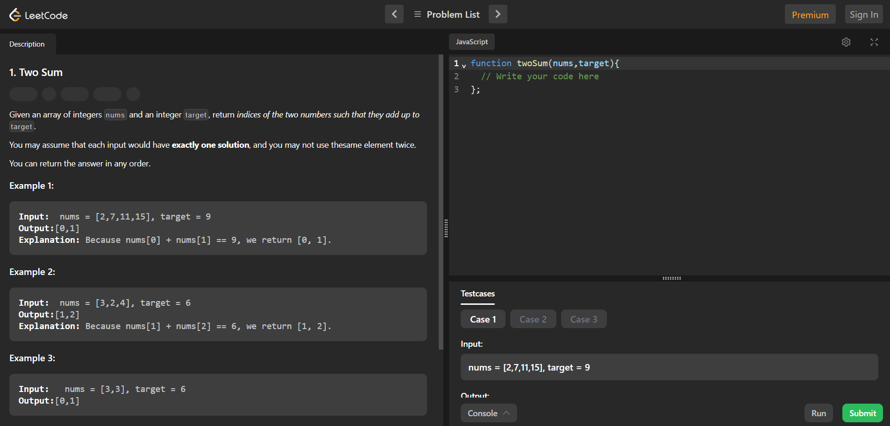

<div align="center">

  <!-- Animated Logo/Banner -->
  <!-- Replace this with a cool GIF of your app in action! -->
  
  
# CodeVerse 🚀

CodeVerse is a feature-rich, web-based platform designed as a LeetCode clone. It provides a space for developers to practice and hone their data structures and algorithms skills with an interactive coding environment, detailed problem descriptions, and user progress tracking.

---
## ✨ Live Demo

You can try out the live application here: **[CodeVerse](https://code-verse-6ji0ghvlk-rishabh028s-projects.vercel.app/)**

---
</div>
## 📸 Screenshots

*Replace the placeholder links below with screenshots of your application.*


_Caption: The homepage displaying the list of available coding problems._


_Caption: The interactive workspace for solving a specific problem._

---
## 📋 Features

* **Full User Authentication**: Secure user registration and login functionality using Firebase Authentication.
* **Dynamic Problem List**: A comprehensive table of coding problems fetched in real-time from a Firestore database.
* **Detailed Problem View**: Each problem has a dedicated page with a clear description, examples, and constraints.
* **Interactive Code Editor**: An in-browser code editor for writing and testing solutions.
* **User Progress Tracking**: Users can track which problems they have solved, liked, disliked, or starred.
* **Embedded Video Solutions**: Direct access to video-based solutions for problems, embedded within the platform.
* **Responsive Design**: A clean and modern UI that works seamlessly across different screen sizes.

---
## 💻 Tech Stack

The project is built with a modern and robust technology stack:


---
## 🚀 Getting Started

To get a local copy up and running, follow these simple steps.

### Prerequisites

Make sure you have Node.js and npm (or yarn) installed on your machine.
* Node.js (v18.x or higher recommended)
* npm

### Installation & Setup

1.  **Clone the repository:**
    ```sh
    git clone [https://github.com/Rishabh028/CodeVerse.git](https://github.com/Rishabh028/CodeVerse.git)
    ```
2.  **Navigate to the project directory:**
    ```sh
    cd CodeVerse
    ```
3.  **Install NPM packages:**
    ```sh
    npm install
    ```
4.  **Set up environment variables:**
    Create a file named `.env.local` in the root of your project and add your Firebase project configuration keys.

    ```env
    NEXT_PUBLIC_FIREBASE_API_KEY="your-api-key"
    NEXT_PUBLIC_FIREBASE_AUTH_DOMAIN="your-auth-domain"
    NEXT_PUBLIC_FIREBASE_PROJECT_ID="your-project-id"
    NEXT_PUBLIC_FIREBASE_STORAGE_BUCKET="your-storage-bucket"
    NEXT_PUBLIC_FIREBASE_MESSAGING_SENDER_ID="your-messaging-sender-id"
    NEXT_PUBLIC_FIREBASE_APP_ID="your-app-id"
    ```

### Running the App

To start the development server, run the following command:
```sh
npm run dev
```
### Open http://localhost:3000 with your browser to see the result.

### 🌐 Deployment
This application is deployed on Vercel. Any push or merge to the main branch will automatically trigger a new deployment, ensuring continuous integration and delivery.
